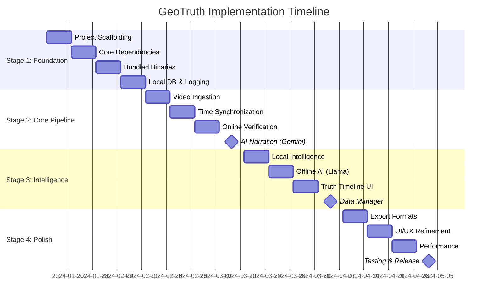

# GeoTruth Narrative Engine - Implementation Roadmap

A comprehensive staged implementation plan for building the GeoTruth Narrative Engine from scratch.

---

## 📋 Executive Summary

| Metric | Value |
|--------|-------|
| **Total Duration** | 16 weeks (4 months) |
| **Team Size** | 2-3 developers |
| **Major Milestones** | 4 stages, 8 checkpoints |
| **MVP Delivery** | Week 8 (Online Mode only) |
| **Full Release** | Week 16 (Hybrid Mode) |

---

## 🎯 Stage 1: Foundation (Weeks 1-4)

**Goal**: Establish project infrastructure, development environment, and basic app shell.

### Week 1: Project Scaffolding

| Task | Deliverable |
|------|-------------|
| Initialize monorepo | `package.json`, `pnpm-workspace.yaml` |
| Setup CI/CD | GitHub Actions for linting, testing |
| Create Tauri desktop shell | Empty window with menu bar |
| Create Docker backend shell | `docker-compose.yml` with healthchecks |

**Checkpoint 1**: ✅ `pnpm dev` opens empty Tauri app, `docker compose up` starts API.

### Week 2: Core Dependencies

| Task | Deliverable |
|------|-------------|
| Configure Tauri v2 + React 19 | Hot-reload working |
| Setup FastAPI with Pydantic | `/health` endpoint returns JSON |
| Configure PostGIS container | Database migrations working |
| Setup Redis caching layer | Connection pool tested |

**Checkpoint 2**: ✅ API connects to PostGIS and Redis, Desktop connects to API.

### Week 3: Bundled Binaries

| Task | Deliverable |
|------|-------------|
| Bundle FFmpeg (multi-platform) | `ffmpeg` sidecar executes |
| Bundle FFprobe | Metadata extraction works |
| Bundle Whisper.cpp | Audio transcription works |
| Create binary download script | CI can fetch binaries |

**Checkpoint 3**: ✅ Desktop app can extract video metadata and transcribe audio.

### Week 4: Local Database & Logging

| Task | Deliverable |
|------|-------------|
| Integrate DuckDB in Rust | Create/read tables works |
| Define event schema | `events` table created |
| Implement structured logging | JSON logs with correlation IDs |
| Add log viewer in app | Can view logs from menu |

**Checkpoint 4**: ✅ Video metadata stored in DuckDB, logs visible in app.

---

## 🔧 Stage 2: Core Pipeline (Weeks 5-8)

**Goal**: Build the end-to-end pipeline for Online Mode (video import → verification → narration).

### Week 5: Video Ingestion

| Task | Deliverable |
|------|-------------|
| Implement video import | Drag-drop or file picker |
| Implement GPX/GPS parsing | Parse GPX, NMEA, GoPro telemetry |
| Generate thumbnail filmstrip | Timeline preview images |
| Store video reference in DB | Video metadata persisted |

**Checkpoint 5**: ✅ User can import video + GPS, see timeline thumbnails.

### Week 6: Time Synchronization

| Task | Deliverable |
|------|-------------|
| Implement automatic sync | Match first GPS timestamp to video start |
| Add manual offset adjustment | Slider to fine-tune sync |
| OCR timestamp detection | Tesseract reads burned-in timestamps |
| Validate sync accuracy | Display sync confidence score |

**Checkpoint 6**: ✅ Video and GPS are time-aligned with confidence indicator.

### Week 7: Online Verification (Valhalla)

| Task | Deliverable |
|------|-------------|
| Setup Valhalla container | Map matching endpoint works |
| Implement API client | Desktop calls `/v1/map_match` |
| Implement POI discovery | PostGIS spatial queries |
| Generate Truth Bundle | JSON structure with verified facts |

**Checkpoint 7**: ✅ GPS trace map-matched to roads, nearby POIs discovered.

### Week 8: AI Narration (Gemini)

| Task | Deliverable |
|------|-------------|
| Implement Gemini client | API call with Truth Bundle |
| Design constraint prompts | Only narrate verified facts |
| Generate chapter markers | YouTube-friendly format |
| Display narration preview | Text view with timestamps |

**🎉 MILESTONE: MVP (Online Mode)**
✅ Full pipeline works: Import → Sync → Verify → Narrate (requires internet).

---

## 🧠 Stage 3: Intelligence (Weeks 9-12)

**Goal**: Add offline capabilities and the Truth Timeline UI.

### Week 9: Local Intelligence Foundation

| Task | Deliverable |
|------|-------------|
| Integrate PMTiles reader | Rust crate reads vector tiles |
| Implement local geocoder | Reverse geocoding works offline |
| Download first map pack | California test region |
| Test offline enrichment | Truth Bundle generated without API |

**Checkpoint 8**: ✅ Basic offline verification works for downloaded regions.

### Week 10: Offline AI Narration

| Task | Deliverable |
|------|-------------|
| Bundle Llama.cpp library | Rust FFI bindings work |
| Implement model loader | Load GGUF from disk |
| Create offline prompts | Stricter than Gemini prompts |
| Add model download UI | Data Manager fetches models |

**Checkpoint 9**: ✅ Narration generated entirely offline using local LLM.

### Week 11: Truth Timeline UI

| Task | Deliverable |
|------|-------------|
| Build timeline component | Zoomable, pannable timeline |
| Display detected events | Markers for POIs, stops, turns |
| Add event editing | User can correct/verify events |
| Show verification status | Online vs Offline verified badge |

**Checkpoint 10**: ✅ User can see and edit all detected events on timeline.

### Week 12: Data Manager

| Task | Deliverable |
|------|-------------|
| Build map pack browser | List available regions |
| Implement download with progress | Show download % |
| Add storage management | View disk usage, delete packs |
| Implement connectivity detection | Auto-switch Online/Offline |

**🎉 MILESTONE: Hybrid Mode Complete**
✅ App works fully offline with downloaded map packs and local LLM.

---

## ✨ Stage 4: Polish (Weeks 13-16)

**Goal**: Finalize UI/UX, add export formats, optimize performance.

### Week 13: Export Formats

| Task | Deliverable |
|------|-------------|
| Export YouTube chapters | Copy-paste format |
| Export SRT subtitles | Standard subtitle file |
| Export narration script | Markdown document |
| Export project archive | ZIP with all assets |

**Checkpoint 11**: ✅ All export formats working.

### Week 14: UI/UX Refinement

| Task | Deliverable |
|------|-------------|
| Implement dark mode | System-aware theme |
| Add keyboard shortcuts | Power user controls |
| Implement undo/redo | Edit history |
| Add onboarding tutorial | First-run wizard |

**Checkpoint 12**: ✅ App feels polished and professional.

### Week 15: Performance Optimization

| Task | Deliverable |
|------|-------------|
| Profile video processing | Identify bottlenecks |
| Optimize DuckDB queries | Index critical columns |
| Implement background processing | Non-blocking UI |
| Add progress indicators | Clear feedback on long ops |

**Checkpoint 13**: ✅ 1hr video processes in <10min (Online) / <20min (Offline).

### Week 16: Testing & Release

| Task | Deliverable |
|------|-------------|
| End-to-end testing | All user flows tested |
| Security audit | Secrets, permissions reviewed |
| Build release binaries | macOS, Windows, Linux |
| Update documentation | Final docs review |

**🎉 MILESTONE: v1.0.0 Release**
✅ Production-ready app with full Hybrid Architecture.

---

## 📊 Dependency Graph

---

## 🧪 Testing Strategy

| Stage | Test Type | Coverage |
|-------|-----------|----------|
| Stage 1 | Unit tests | 80% Rust/Python |
| Stage 2 | Integration tests | API + Desktop IPC |
| Stage 3 | E2E tests | Full user flows |
| Stage 4 | Manual QA | Cross-platform |

---

## 🚀 Deployment Milestones

| Version | Week | Scope |
|---------|------|-------|
| **v0.1.0-alpha** | 4 | Dev preview (no features) |
| **v0.5.0-beta** | 8 | MVP (Online Mode only) |
| **v0.9.0-rc** | 12 | Hybrid Mode complete |
| **v1.0.0** | 16 | Production release |

---

## 📚 Related Documentation

- [Project Specification](PROJECT_SPEC.md)
- [Architecture Overview](architecture/README.md)
- [Local Intelligence Layer](architecture/local-intelligence.md)
- [Development Guide](development/README.md)

---

*Version: 1.0.0*
*Last Updated: 2024-01-15*
