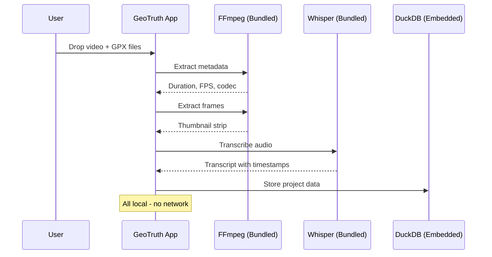
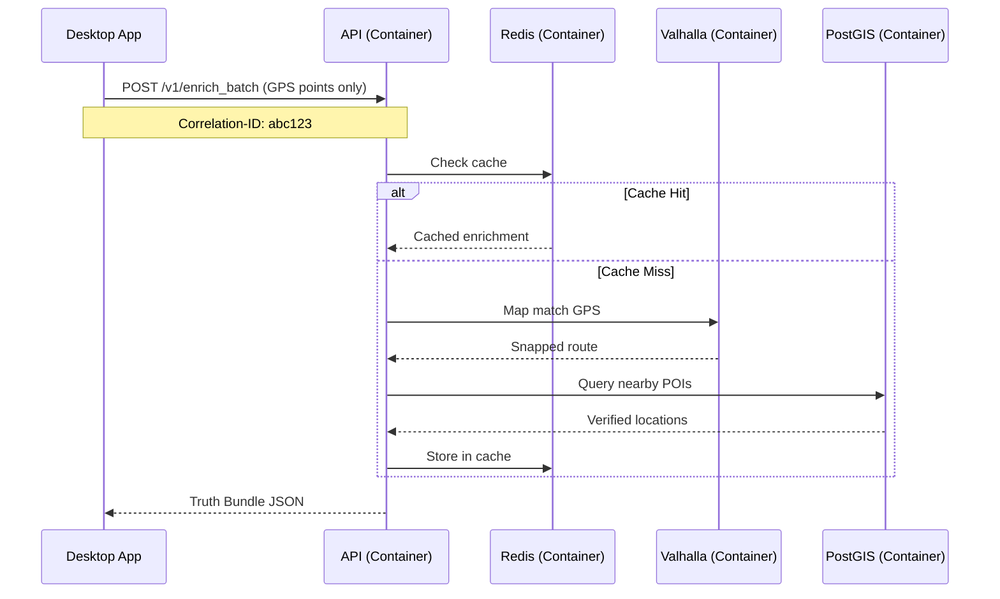
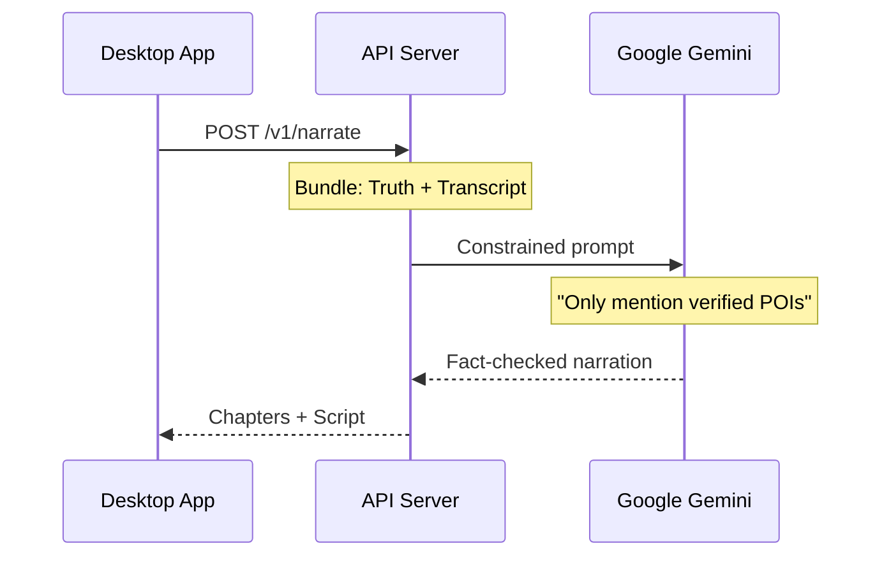

# Architecture Overview

This document describes the high-level architecture of the GeoTruth Narrative Engine, emphasizing **zero local dependencies**, **service isolation**, and **structured logging**.

---

## 📐 System Design

### Core Principles

1. **Zero Local Dependencies**
   - Backend: 100% Docker containers
   - Desktop: Self-contained app with bundled binaries
   - Development: Docker-based, no local toolchain

2. **Service Isolation**
   - Each service in its own container
   - Internal network for sensitive services
   - No direct database access from outside

3. **Structured Logging**
   - JSON format for machine parsing
   - Correlation IDs across all services
   - Unified log format everywhere

---

## 🏗️ Deployment Architecture

```
┌─────────────────────────────────────────────────────────────────────────────┐
│                              USER'S MACHINE                                  │
│                                                                              │
│  ┌────────────────────────────────────────────────────────────────────────┐ │
│  │                    GeoTruth Desktop App (Bundled)                       │ │
│  │  ┌──────────────┐  ┌──────────────┐  ┌────────────────────────────┐   │ │
│  │  │ React UI     │  │ Rust Core    │  │ Bundled Binaries           │   │ │
│  │  │ (Bundled)    │  │ (Compiled)   │  │ FFmpeg, Whisper, Tesseract │   │ │
│  │  └──────────────┘  └──────────────┘  └────────────────────────────┘   │ │
│  └────────────────────────────────┬───────────────────────────────────────┘ │
│                                   │                                          │
│                                   │ HTTPS (Anonymized GPS only)             │
│                                   ▼                                          │
│  ┌────────────────────────────────────────────────────────────────────────┐ │
│  │                    Docker Compose (Backend)                             │ │
│  │                                                                          │ │
│  │  ┌─────────────────────────────────────────────────────────────────┐   │ │
│  │  │                    Frontend Network                              │   │ │
│  │  │  ┌──────────────────────────────────────────────────────────┐   │   │ │
│  │  │  │  API Server (FastAPI) ─────────────────────────────────┐ │   │   │ │
│  │  │  │  Port: 8000                                            │ │   │   │ │
│  │  │  └────────────────────────────────────────────────────────┘ │   │   │ │
│  │  └──────────────────────────────────────┬──────────────────────┘   │   │ │
│  │                                         │                          │   │ │
│  │  ┌──────────────────────────────────────┼──────────────────────┐   │   │ │
│  │  │          Backend Network (INTERNAL - No External Access)    │   │   │ │
│  │  │                                      │                      │   │   │ │
│  │  │  ┌──────────────┐  ┌────────────────┼─┐  ┌──────────────┐  │   │   │ │
│  │  │  │  PostGIS     │  │  Redis         │ │  │  Valhalla    │  │   │   │ │
│  │  │  │  Database    │◄─│  Cache         │◄├──│  Routing     │  │   │   │ │
│  │  │  │  Port: 5432  │  │  Port: 6379    │ │  │  Port: 8002  │  │   │   │ │
│  │  │  └──────────────┘  └────────────────┘ │  └──────────────┘  │   │   │ │
│  │  │         ▲                   ▲         │         ▲          │   │   │ │
│  │  │         │                   │         └─────────┘          │   │   │ │
│  │  │         └───────────────────┴──────────────────────────────┼───┘   │ │
│  │  │                    (Only API can access)                   │       │ │
│  │  └────────────────────────────────────────────────────────────┘       │ │
│  └────────────────────────────────────────────────────────────────────────┘ │
└─────────────────────────────────────────────────────────────────────────────┘
```

---

## 📊 Data Flow

### 1. Ingest Phase (Local - Desktop)



### 2. Enrichment Phase (Cloud - Docker)



### 3. Narration Phase (AI)



---

## 🔒 Security Architecture

### Network Isolation

```
┌─────────────────────────────────────────────────────────────┐
│                     Docker Networks                          │
├─────────────────────────────────────────────────────────────┤
│                                                              │
│  Frontend Network (frontend)                                 │
│  ┌────────────────────────────────────────────────────────┐ │
│  │                                                         │ │
│  │  ┌─────────────┐                                       │ │
│  │  │  API Server │ ◄──── External Access (Port 8000)     │ │
│  │  └──────┬──────┘                                       │ │
│  │         │                                               │ │
│  └─────────┼───────────────────────────────────────────────┘ │
│            │                                                 │
│  Backend Network (backend)  [internal: true]                │
│  ┌─────────┼───────────────────────────────────────────────┐ │
│  │         ▼                                               │ │
│  │  ┌────────────┐  ┌──────────┐  ┌────────────────────┐  │ │
│  │  │  PostGIS   │  │  Redis   │  │  Valhalla          │  │ │
│  │  │            │  │          │  │                    │  │ │
│  │  └────────────┘  └──────────┘  └────────────────────┘  │ │
│  │                                                         │ │
│  │  ⛔ No external access - only API can reach these      │ │
│  └─────────────────────────────────────────────────────────┘ │
│                                                              │
└─────────────────────────────────────────────────────────────┘
```

### Secret Management

| Location | Storage Method |
|----------|---------------|
| Desktop App | OS Keychain (macOS Keychain, Windows Credential Manager) |
| Backend | Docker Secrets / Environment Variables |

---

## 📊 Logging Architecture

All components emit structured JSON logs with correlation IDs:

```
┌─────────────────────────────────────────────────────────────┐
│                      Log Flow                                │
├─────────────────────────────────────────────────────────────┤
│                                                              │
│  Desktop App                                                 │
│  ┌─────────────────────────────────────────────────────────┐│
│  │  Rust Backend → JSON logs → File (~/.../logs/)          ││
│  │  React Frontend → Console logs → Rust (errors/warnings) ││
│  └─────────────────────────────────────────────────────────┘│
│                                                              │
│  Backend Services                                            │
│  ┌─────────────────────────────────────────────────────────┐│
│  │  API → JSON logs → stdout → Docker logging driver       ││
│  │  PostGIS → stdout → Docker logging driver               ││
│  │  Redis → stdout → Docker logging driver                 ││
│  │  Valhalla → stdout → Docker logging driver              ││
│  └─────────────────────────────────────────────────────────┘│
│                            │                                 │
│                            ▼                                 │
│  ┌─────────────────────────────────────────────────────────┐│
│  │  Log Aggregation (Optional)                              ││
│  │  ELK Stack / Grafana Loki / CloudWatch                   ││
│  └─────────────────────────────────────────────────────────┘│
│                                                              │
└─────────────────────────────────────────────────────────────┘
```

### Correlation ID Flow

```
Request Flow:
Desktop App ─────────────────────────────────────────────────────────►
    │                                                                 
    │ X-Correlation-ID: abc-123                                      
    ▼                                                                 
API Server ──────────────────────────────────────────────────────────►
    │ Log: {"correlation_id": "abc-123", "message": "Enriching..."}  
    │                                                                 
    │ Internal calls include correlation_id                          
    ▼                                                                 
PostGIS ─────────────────────────────────────────────────────────────►
    │ Log: {"correlation_id": "abc-123", "query_ms": 15}             
    ▼                                                                 
Response ◄───────────────────────────────────────────────────────────
    X-Correlation-ID: abc-123
```

---

## 🧰 Technology Matrix

### Latest Versions (Pinned)

| Component | Technology | Version | Container |
|-----------|------------|---------|-----------|
| **API Runtime** | Python | 3.12 | ✅ |
| **API Framework** | FastAPI | 0.115+ | ✅ |
| **Database** | PostgreSQL + PostGIS | 17 + 3.5 | ✅ |
| **Routing** | Valhalla | 3.5 | ✅ |
| **Cache** | Redis | 7.4 | ✅ |
| **Desktop Runtime** | Rust | 1.83 | Bundled |
| **Desktop UI** | React | 19 | Bundled |
| **Video Processing** | FFmpeg | 7.1 | Bundled |
| **Transcription** | Whisper.cpp | 1.7 | Bundled |
| **Local DB** | DuckDB | 1.1 | Compiled |

---

## 📁 Data Models

### Event (Desktop - DuckDB)

```sql
CREATE TABLE events (
    id UUID PRIMARY KEY,
    project_id UUID NOT NULL,
    video_path TEXT NOT NULL,
    start_time TIMESTAMP NOT NULL,
    end_time TIMESTAMP NOT NULL,
    geo_lat DOUBLE,
    geo_lon DOUBLE,
    event_type TEXT,
    confidence FLOAT,
    truth_json JSON,
    transcript TEXT,
    narration TEXT,
    user_verified BOOLEAN DEFAULT FALSE,
    created_at TIMESTAMP DEFAULT CURRENT_TIMESTAMP
);
```

### Truth Bundle (API Response)

```json
{
  "event_id": "uuid",
  "correlation_id": "req-abc123",
  "matched_location": {
    "lat": 36.1069,
    "lon": -112.1129,
    "road_name": "AZ-64"
  },
  "visible_pois": [
    {
      "name": "Grand Canyon South Rim",
      "type": "natural_landmark",
      "confidence": 0.95
    }
  ],
  "processing": {
    "map_match_ms": 45,
    "poi_query_ms": 12,
    "cache_hit": false
  }
}
```

---

## 📚 Related Documentation

- [Backend Services](../backend/README.md)
- [Desktop Application](../desktop/README.md)
- [Logging Guide](../logging.md)
- [API Reference](../api/README.md)
- [Security Guidelines](../security/README.md)
