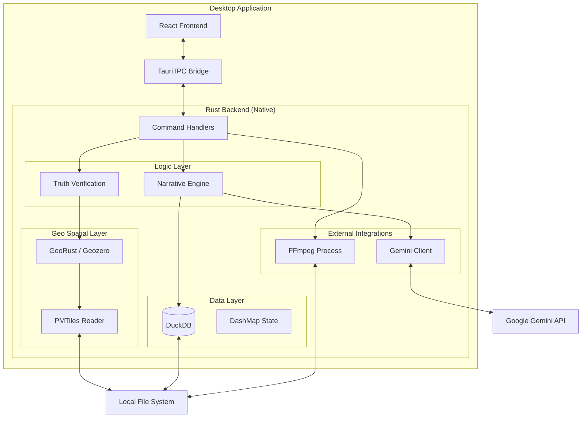

# Architecture Overview

This document describes the high-level architecture of the GeoTruth Narrative Engine, emphasizing **high-performance local processing** and **cloud-native intelligence**.

---

## 📐 System Design

### Core Principles

1.  **Native Monolith**
    *   Single binary application (Rust + React).
    *   No Docker, no external database servers.
    *   Direct hardware access (GPU) for media processing.

2.  **Embedded First**
    *   **Database**: DuckDB (In-process SQL OLAP).
    *   **Maps**: PMTiles (Local vector tiles).
    *   **State**: DashMap (In-memory concurrency).

3.  **Hybrid Intelligence**
    *   **Verify**: Local GeoRust algorithms validate location data.
    *   **Narrate**: Google Gemini (Cloud) generates creative content.

---

## 🏗️ Monolithic Architecture

---

## 📊 Data Flow

### 1. Ingest Phase (Local)
1.  **User** drops video files.
2.  **FFmpeg** (managed by Rust) probes files for metadata and extracts GPMD (GoPro Metadata) / Subtitles.
3.  **Rust** parses telemetry and inserts raw track points into **DuckDB** (Spatial Extension).

### 2. Enrichment Phase (Verification)
1.  **Frontend** requests verification via IPC.
2.  **Enrichment Engine** queries **DuckDB** for points.
3.  **GeoRust** performs point-in-polygon checks against local **PMTiles** (Parks, Cities, Landmarks).
4.  Verified "Truth Bundle" (JSON) is stored in **DashMap**.

### 3. Narration Phase (AI)
1.  **Rust** constructs a structured prompt from the Truth Bundle.
2.  **Gemini Client** sends prompt to Google Gemini API (secure HTTPS).
3.  **Gemini** returns narrative script and chapters.
4.  Result is stored in **DuckDB**.

---

## 🔒 Security Architecture

*   **No Server**: Zero attack surface from open ports.
*   **Encrypted Storage**: Sensitive keys (API tokens) stored in OS Keychain via Tauri plugin.
*   **Privacy**: Video pixels never leave the device. Only anonymized text metadata is sent to Gemini.
