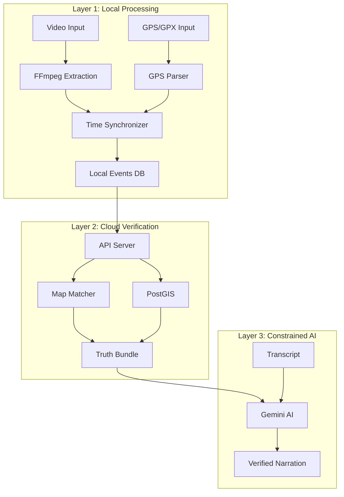
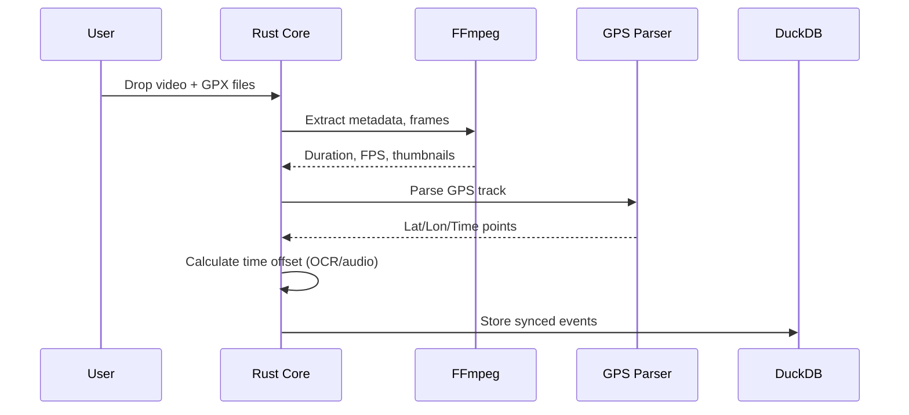
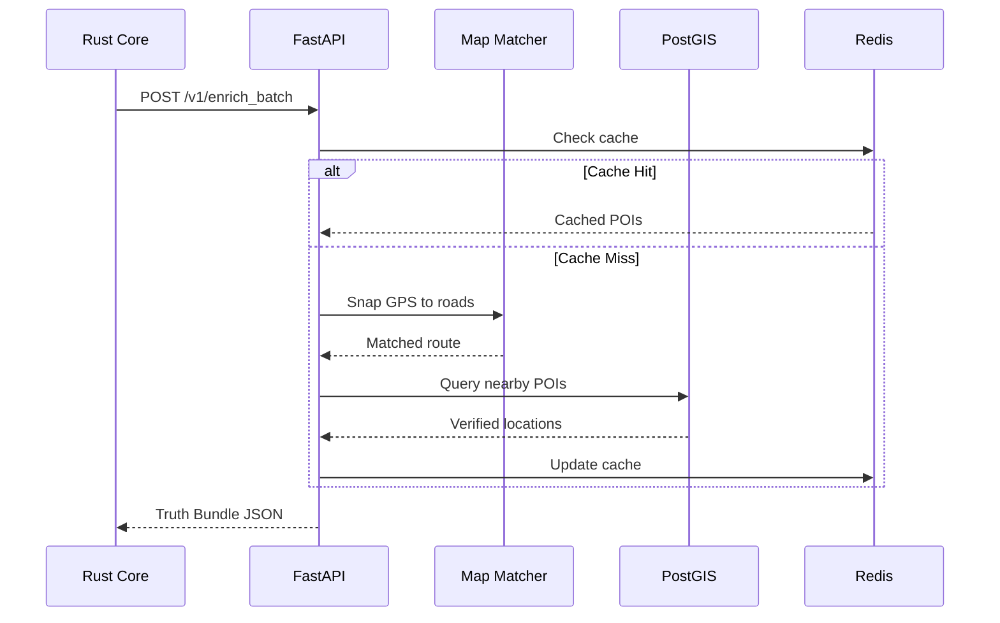
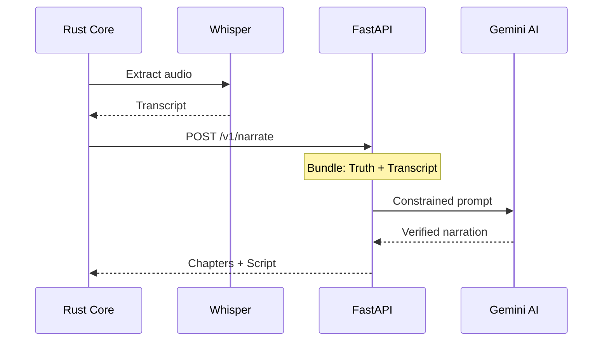

# Architecture Overview

This document describes the high-level architecture of the GeoTruth Narrative Engine, explaining how components interact to deliver fact-checked, AI-narrated travel stories.

---

## 📐 System Design

### Core Philosophy: "Verify First, Narrate Second"

The GeoTruth architecture is built on a fundamental principle: **AI should never hallucinate geographic facts**. This is achieved through a three-layer verification system:



---

## 🏗️ Component Architecture

### Desktop Application (Tauri v2)

The desktop app is the primary user interface and handles all privacy-sensitive operations locally.

```
┌─────────────────────────────────────────────────────────┐
│                    Tauri Desktop App                     │
├─────────────────────────────────────────────────────────┤
│  ┌─────────────────┐  ┌─────────────────────────────┐  │
│  │   React Frontend │  │      Rust Core Engine       │  │
│  │                   │  │                             │  │
│  │  • Truth Timeline │  │  • Video Processing         │  │
│  │  • Map View       │  │  • GPS Parsing              │  │
│  │  • Event Editor   │  │  • Time Synchronization     │  │
│  │  • Export Panel   │  │  • DuckDB Management        │  │
│  │                   │  │  • Sidecar Orchestration    │  │
│  └─────────────────┘  └─────────────────────────────┘  │
├─────────────────────────────────────────────────────────┤
│                     Sidecar Binaries                     │
│  ┌─────────┐  ┌─────────┐  ┌─────────┐  ┌───────────┐  │
│  │ FFmpeg  │  │ FFprobe │  │ Whisper │  │ Tesseract │  │
│  └─────────┘  └─────────┘  └─────────┘  └───────────┘  │
└─────────────────────────────────────────────────────────┘
```

### Backend Services (Docker Compose)

The cloud infrastructure provides geospatial intelligence without ever receiving video data.

```
┌─────────────────────────────────────────────────────────┐
│                 Docker Compose Stack                     │
├─────────────────────────────────────────────────────────┤
│                                                          │
│  ┌─────────────┐    ┌─────────────┐    ┌────────────┐  │
│  │  API Server │────│    Redis    │────│  PostGIS   │  │
│  │  (FastAPI)  │    │   (Cache)   │    │ (Geo Data) │  │
│  └──────┬──────┘    └─────────────┘    └────────────┘  │
│         │                                                │
│         │           ┌─────────────────────────────────┐ │
│         └──────────▶│       Valhalla / OSRM           │ │
│                     │      (Map Matching)              │ │
│                     └─────────────────────────────────┘ │
│                                                          │
└─────────────────────────────────────────────────────────┘
```

---

## 📊 Data Flow

### 1. Ingest Phase (Local)



### 2. Enrichment Phase (Cloud)



### 3. Narration Phase (AI)



---

## 🔒 Security Architecture

### API Key Management

```
┌─────────────────────────────────────────────┐
│            Desktop Application               │
│  ┌───────────────────────────────────────┐  │
│  │          OS Native Keychain            │  │
│  │  • JWT Auth Token                      │  │
│  │  • User's Gemini API Key (BYOK)        │  │
│  └───────────────────────────────────────┘  │
│  ┌───────────────────────────────────────┐  │
│  │        tauri-plugin-store              │  │
│  │  • Theme preferences                   │  │
│  │  • Default export paths                │  │
│  │  • UI settings                         │  │
│  └───────────────────────────────────────┘  │
└─────────────────────────────────────────────┘

┌─────────────────────────────────────────────┐
│             Backend Services                 │
│  ┌───────────────────────────────────────┐  │
│  │    Environment Variables (.env)        │  │
│  │  • DATABASE_URL                        │  │
│  │  • REDIS_URL                           │  │
│  │  • GEMINI_API_KEY                      │  │
│  │  • JWT_SECRET                          │  │
│  └───────────────────────────────────────┘  │
└─────────────────────────────────────────────┘
```

### Privacy Boundaries

| Data Type | Processed Where | Sent to Cloud? |
|-----------|-----------------|----------------|
| Raw Video | Desktop (local) | ❌ Never |
| Audio | Desktop (local) | ❌ Never |
| Thumbnails | Desktop (local) | ❌ Never |
| GPS Coordinates | Desktop → Cloud | ✅ Anonymized |
| Transcript | Desktop (local) | ✅ For narration |
| Generated Script | Cloud → Desktop | ✅ Returned |

---

## 📁 Data Models

### Event (Local - DuckDB)

```sql
CREATE TABLE events (
    id UUID PRIMARY KEY,
    project_id UUID NOT NULL,
    video_path TEXT NOT NULL,
    start_time TIMESTAMP NOT NULL,
    end_time TIMESTAMP NOT NULL,
    geo_lat DOUBLE,
    geo_lon DOUBLE,
    event_type TEXT,           -- 'stop', 'poi', 'landmark', 'manual'
    confidence FLOAT,
    truth_json JSON,           -- Enriched data from cloud
    transcript TEXT,
    narration TEXT,
    user_verified BOOLEAN DEFAULT FALSE,
    created_at TIMESTAMP DEFAULT CURRENT_TIMESTAMP,
    updated_at TIMESTAMP DEFAULT CURRENT_TIMESTAMP
);
```

### Truth Bundle (API Response)

```json
{
  "event_id": "uuid",
  "matched_location": {
    "lat": 36.1069,
    "lon": -112.1129,
    "road_name": "AZ-64",
    "road_type": "highway"
  },
  "visible_pois": [
    {
      "name": "Grand Canyon South Rim",
      "type": "natural_landmark",
      "distance_m": 150,
      "in_field_of_view": true,
      "confidence": 0.95
    }
  ],
  "context": {
    "elevation_m": 2134,
    "timezone": "America/Phoenix",
    "country": "USA",
    "region": "Arizona"
  }
}
```

---

## 🔌 Integration Points

### External Services

| Service | Purpose | Integration |
|---------|---------|-------------|
| **Google Gemini** | AI narration | REST API |
| **OpenStreetMap** | Base map data | PostGIS import |
| **Valhalla** | Route matching | Docker container |
| **Overpass API** | POI data | Batch import |

### Desktop Sidecars

| Binary | Purpose | Invocation |
|--------|---------|------------|
| **FFmpeg** | Video extraction | `tauri::api::process::Command` |
| **FFprobe** | Metadata reading | `tauri::api::process::Command` |
| **Whisper** | Transcription | `tauri::api::process::Command` |
| **Tesseract** | OCR (time sync) | Rust bindings |

---

## 📈 Scalability Considerations

### Desktop Performance

- **DuckDB** handles millions of GPS points efficiently
- **Chunked processing** for large video files
- **Background threads** for sidecar operations
- **Incremental saves** to prevent data loss

### Backend Scalability

- **Redis caching** reduces PostGIS load
- **Batch API endpoints** minimize round trips
- **Valhalla tiling** for regional coverage
- **Horizontal scaling** via Docker Swarm/K8s

---

## 📚 Related Documentation

- [Desktop App Development](../desktop/README.md)
- [Backend Services](../backend/README.md)
- [API Reference](../api/README.md)
- [Security Guidelines](../security/README.md)
