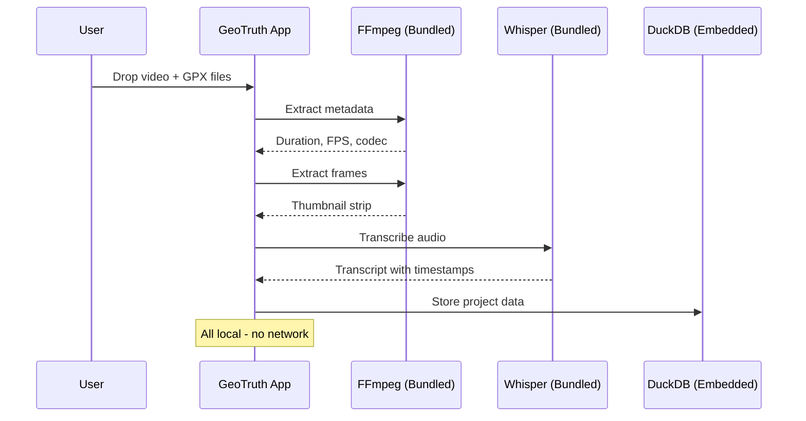
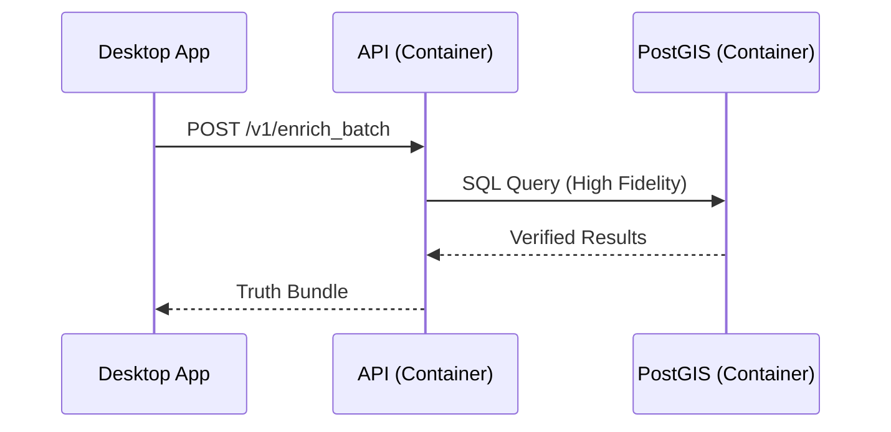
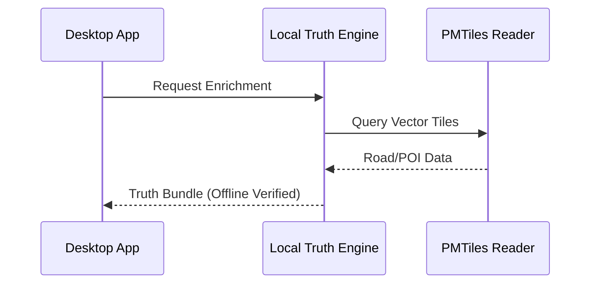

# Architecture Overview

This document describes the high-level architecture of the GeoTruth Narrative Engine, emphasizing **zero local dependencies**, **service isolation**, and **Hybrid Connectivity**.

---

## 📐 System Design

### Core Principles

1. **Hybrid Connectivity**
   - **Online Mode**: Uses Docker-based backend for high-fidelity verification.
   - **Offline Mode**: Uses local Rust-based "Truth Engine" for standalone usage.
   - *Result*: The app works 100% offline for travelers in remote areas.

2. **Zero Local Dependencies**
   - Backend: 100% Docker containers.
   - Desktop: Self-contained app with bundled binaries (FFmpeg, Whisper, Llama.cpp).
   - Development: Docker-based, no local toolchain.

3. **Service Isolation**
   - Each backend service in its own container.
   - Internal network for sensitive services.

4. **Structured Logging**
   - JSON format for machine parsing.
   - Correlation IDs across all services.

---

## 🏗️ Hybrid Architecture

```
┌─────────────────────────────────────────────────────────────────────────────┐
│                              USER'S MACHINE                                  │
│                                                                              │
│  ┌────────────────────────────────────────────────────────────────────────┐ │
│  │                    GeoTruth Desktop App (Bundled)                       │ │
│  │                                                                         │ │
│  │  ┌──────────────┐  ┌──────────────┐  ┌────────────────────────────┐   │ │
│  │  │ React UI     │  │ Rust Core    │  │ Bundled Binaries           │   │ │
│  │  │ (Bundled)    │  │ (Compiled)   │  │ FFmpeg, Whisper, Tesseract │   │ │
│  │  └──────┬───────┘  └──────┬───────┘  │ Llama.cpp (Optional)       │   │ │
│  │         │                 │          └────────────────────────────┘   │ │
│  │         │          ┌──────▼──────┐                                    │ │
│  │         │          │ Local Truth │ ◄── [OFFLINE PATH]                 │ │
│  │         │          │ Engine      │    Map Matching & Geocoding        │ │
│  │         │          └──────┬──────┘    via PMTiles                     │ │
│  │         │                 │                                           │ │
│  └─────────┼─────────────────┼───────────────────────────────────────────┘ │
│            │                 │                                             │
│            ▼                 ▼ [ONLINE PATH]                               │
│  ┌────────────────────────────────────────────────────────────────────────┐ │
│  │                    Docker Compose (Backend)                             │ │
│  │                                                                          │ │
│  │  ┌─────────────────────────────────────────────────────────────────┐   │ │
│  │  │                    Frontend Network                              │   │ │
│  │  │  ┌──────────────────────────────────────────────────────────┐   │   │ │
│  │  │  │  API Server (FastAPI) ─────────────────────────────────┐ │   │   │ │
│  │  │  │  Port: 8000                                            │ │   │   │ │
│  │  │  └────────────────────────────────────────────────────────┘ │   │   │ │
│  │  └──────────────────────────────────────┬──────────────────────┘   │   │ │
│  │                                         │                          │   │ │
│  │  ┌──────────────────────────────────────┼──────────────────────┐   │   │ │
│  │  │          Backend Network (INTERNAL - No External Access)    │   │   │ │
│  │  │                                      │                      │   │   │ │
│  │  │  ┌──────────────┐  ┌────────────────┼─┐  ┌──────────────┐  │   │   │ │
│  │  │  │  PostGIS     │  │  Redis         │ │  │  Valhalla    │  │   │   │ │
│  │  │  │  Database    │◄─│  Cache         │◄├──│  Routing     │  │   │   │ │
│  │  │  │  Port: 5432  │  │  Port: 6379    │ │  │  Port: 8002  │  │   │   │ │
│  │  │  └──────────────┘  └────────────────┘ │  └──────────────┘  │   │   │ │
│  │  │         ▲                   ▲         │         ▲          │   │   │ │
│  │  │         │                   │         └─────────┘          │   │   │ │
│  │  │         └───────────────────┴──────────────────────────────┼───┘   │ │
│  │  │                    (Only API can access)                   │       │ │
│  │  └────────────────────────────────────────────────────────────┘       │ │
│  └────────────────────────────────────────────────────────────────────────┘ │
└─────────────────────────────────────────────────────────────────────────────┘
```

---

## 📊 Data Flow

### 1. Ingest Phase (Local - Desktop)



### 2. Enrichment Phase (Verification)

The app chooses the path based on connectivity and settings.

#### A. Online Mode (Docker)



#### B. Offline Mode (Local)



### 3. Narration Phase (AI)

#### A. Online (Gemini)
High creativity, broader knowledge, faster inference (cloud GPU).

#### B. Offline (Llama.cpp)
Private, works anywhere, dependent on user hardware.

---

## 🔒 Security Architecture

### Network Isolation

Services are isolated in Docker networks (`frontend` vs `backend`).

### Privacy
- **Offline Mode**: No network calls made. 100% Air-gapped compatible.
- **Online Mode**: Anonymized GPS data sent to backend; Original video *never* sent.

---

## 📚 Related Documentation

- [Local Intelligence Layer (Offline)](local-intelligence.md)
- [Backend Services](../backend/README.md)
- [Desktop Application](../desktop/README.md)
- [Logging Guide](../logging.md)
