# The Truth Engine

The Truth Engine is the core geospatial verification system that ensures all AI-generated narration is based on verified facts. This document explains its components and algorithms.

---

## 🎯 Purpose

The Truth Engine solves the fundamental problem with AI video narration: **hallucination**. Instead of asking AI to "guess" what's in a video, we prove it mathematically first.

```
Traditional AI:  Video → AI → "I think this is the Grand Canyon"
GeoTruth:        Video + GPS → Verification → AI → "This IS the Grand Canyon"
```

---

## 🧩 Core Components

### 1. Map Matching

**Problem:** Raw GPS data is noisy and often shows you "in the middle of a building" or "driving through a lake."

**Solution:** Snap GPS points to the actual road network.

```mermaid
graph LR
    subgraph "Raw GPS"
        R1((•)) --> R2((•)) --> R3((•)) --> R4((•))
    end
    
    subgraph "Map Matching"
        MM[Valhalla Engine]
    end
    
    subgraph "Matched Route"
        M1((•)) --> M2((•)) --> M3((•)) --> M4((•))
    end
    
    R1 -.-> MM
    R2 -.-> MM
    R3 -.-> MM
    R4 -.-> MM
    MM --> M1
```



#### Algorithm (Valhalla)

1. Build a probabilistic model of GPS error (typically 5-50m)
2. Create candidate road segments within error radius
3. Use Hidden Markov Model (HMM) to find most likely path
4. Output: Exact road, direction, and lane position

#### API Endpoint

```python
POST /v1/map_match

Request:
{
  "coordinates": [
    {"lat": 36.1069, "lon": -112.1129, "timestamp": "2024-01-15T10:30:00Z"},
    {"lat": 36.1070, "lon": -112.1125, "timestamp": "2024-01-15T10:30:05Z"}
  ],
  "costing": "auto"  # or "pedestrian", "bicycle"
}

Response:
{
  "matched_points": [...],
  "edges": [
    {
      "way_id": 12345,
      "road_name": "AZ-64",
      "road_class": "primary",
      "length_m": 150
    }
  ]
}
```

---

### 2. Field-of-View Filtering

**Problem:** A POI might be nearby but behind the camera or blocked by terrain.

**Solution:** Calculate what the camera could actually see.

```
                    Camera Direction
                          ↑
                         /|\
                        / | \
                       /  |  \
                      / FOV=120°\
                     /    |    \
                    /     |     \
        ─────────────────────────────────
              ❌         ✅        ❌
           (behind)  (visible)  (behind)
```

#### Algorithm

```python
def is_in_field_of_view(camera_pos, camera_heading, poi_pos, fov_degrees=120):
    """
    Determine if a POI is within the camera's field of view.
    
    Args:
        camera_pos: (lat, lon) of camera
        camera_heading: Bearing in degrees (0-360, north=0)
        poi_pos: (lat, lon) of point of interest
        fov_degrees: Camera field of view (default 120° for GoPro)
    
    Returns:
        bool: True if POI is visible
    """
    # Calculate bearing from camera to POI
    bearing_to_poi = calculate_bearing(camera_pos, poi_pos)
    
    # Calculate angular difference
    angle_diff = abs(camera_heading - bearing_to_poi)
    if angle_diff > 180:
        angle_diff = 360 - angle_diff
    
    # Check if within half the FOV
    return angle_diff <= (fov_degrees / 2)
```

#### Viewshed Analysis (Advanced)

For terrain blocking, we integrate elevation data:


---

### 3. POI Discovery

**Problem:** Know what landmarks, businesses, and features exist at a location.

**Solution:** Query PostGIS with spatial awareness.

#### Database Schema

```sql
-- POI Table
CREATE TABLE pois (
    id SERIAL PRIMARY KEY,
    name TEXT NOT NULL,
    category TEXT NOT NULL,        -- 'landmark', 'business', 'natural', etc.
    subcategory TEXT,
    geom GEOMETRY(Point, 4326),
    tags JSONB,
    source TEXT,                   -- 'osm', 'manual', 'verified'
    confidence FLOAT DEFAULT 0.8,
    created_at TIMESTAMP DEFAULT NOW()
);

-- Spatial Index
CREATE INDEX idx_pois_geom ON pois USING GIST (geom);

-- Category Index
CREATE INDEX idx_pois_category ON pois (category);
```

#### Query Example

```sql
-- Find POIs within 500m of a point, in field of view
SELECT 
    p.id,
    p.name,
    p.category,
    ST_Distance(p.geom::geography, ST_MakePoint(-112.1129, 36.1069)::geography) as distance_m
FROM pois p
WHERE ST_DWithin(
    p.geom::geography,
    ST_MakePoint(-112.1129, 36.1069)::geography,
    500  -- meters
)
ORDER BY distance_m;
```

---

### 4. Visual Verification (Zoo Mode)

**Problem:** GPS is unreliable indoors or in dense environments (zoos, malls, forests).

**Solution:** Use computer vision to detect objects and cross-reference with location data.


#### Object-Location Correlation

```python
def correlate_vision_with_location(detected_objects, gps_location, radius_m=100):
    """
    Cross-reference detected objects with known locations.
    """
    correlations = []
    
    for obj in detected_objects:
        # Query POIs that match this object type
        nearby_pois = query_pois_by_type(
            location=gps_location,
            object_type=obj.label,
            radius=radius_m
        )
        
        for poi in nearby_pois:
            correlation = {
                "detected": obj.label,
                "matched_poi": poi.name,
                "distance_m": poi.distance,
                "confidence": calculate_confidence(obj, poi)
            }
            correlations.append(correlation)
    
    return correlations
```

---

## 📦 Truth Bundle Format

The final output of the Truth Engine is a structured "Truth Bundle" that AI can use:

```json
{
  "event_id": "550e8400-e29b-41d4-a716-446655440000",
  "timestamp": "2024-01-15T10:30:00Z",
  "duration_seconds": 45,
  
  "location": {
    "raw_gps": {"lat": 36.1069, "lon": -112.1129},
    "matched": {
      "lat": 36.1068,
      "lon": -112.1130,
      "road": "AZ-64",
      "road_type": "highway",
      "direction": "eastbound"
    },
    "context": {
      "country": "United States",
      "state": "Arizona",
      "county": "Coconino",
      "timezone": "America/Phoenix",
      "elevation_m": 2134
    }
  },
  
  "verified_pois": [
    {
      "name": "Grand Canyon South Rim",
      "type": "natural_landmark",
      "category": "national_park",
      "distance_m": 150,
      "bearing_deg": 45,
      "in_fov": true,
      "confidence": 0.98,
      "facts": {
        "established": "1919",
        "depth_m": 1857,
        "unesco_site": true
      }
    }
  ],
  
  "detected_objects": [
    {
      "label": "canyon_viewpoint",
      "confidence": 0.92,
      "correlated_with": "Grand Canyon South Rim"
    }
  ],
  
  "metadata": {
    "camera_heading_deg": 90,
    "speed_kmh": 0,
    "stopped": true,
    "weather": "clear"
  }
}
```

---

## ⚙️ Configuration

### Truth Engine Settings

```yaml
# config/truth_engine.yaml

map_matching:
  engine: "valhalla"
  costing_model: "auto"
  search_radius_m: 50
  
field_of_view:
  default_fov_degrees: 120
  enable_viewshed: true
  elevation_data_source: "srtm"
  
poi_discovery:
  search_radius_m: 500
  min_confidence: 0.7
  categories:
    - "landmark"
    - "natural"
    - "tourism"
    - "historic"
  
visual_verification:
  enabled: true
  model: "yolov8"
  min_detection_confidence: 0.6
  correlation_radius_m: 100
  
caching:
  enabled: true
  ttl_seconds: 86400
  redis_prefix: "truth_engine"
```

---

## 📈 Performance Metrics

| Operation | Typical Latency | Cache Hit Rate |
|-----------|-----------------|----------------|
| Map Matching (100 points) | 150ms | N/A |
| POI Query (500m radius) | 25ms | 85% |
| FOV Calculation | 2ms | N/A |
| Visual Correlation | 50ms | 70% |
| Full Truth Bundle | 200ms | 60% |

---

## 🔗 Related Documentation

- [API Reference](../api/README.md)
- [Backend Services](../backend/README.md)
- [PostGIS Setup](../backend/postgis.md)
